# I. Very Easy

## Don't Overreact

APK file: https://github.com/h2oa/h2oa.github.io/blob/main/assets/apks/dontoverreact.apk

Từ tên challenge biết APK code bằng React, mở jadx xem file `index.android.bundle`:

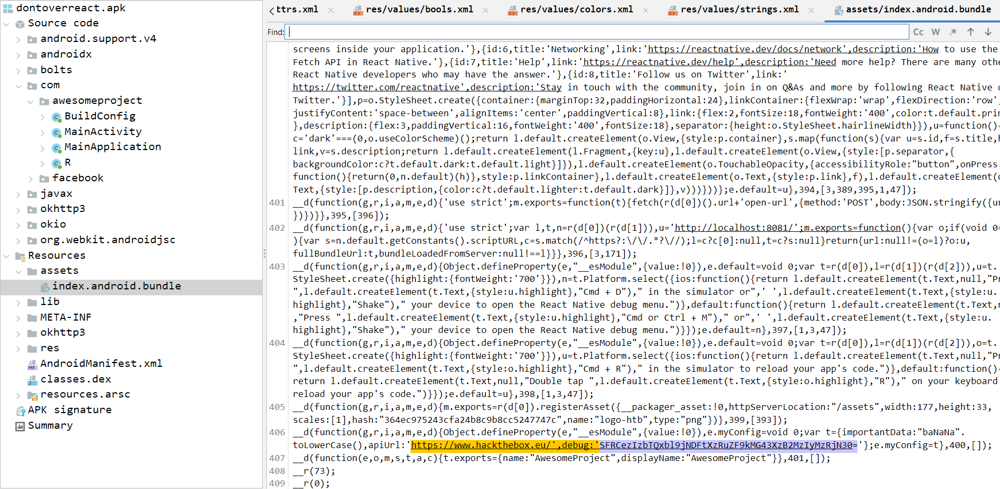

Thấy chuỗi base64 khả nghi, decode ra flag:

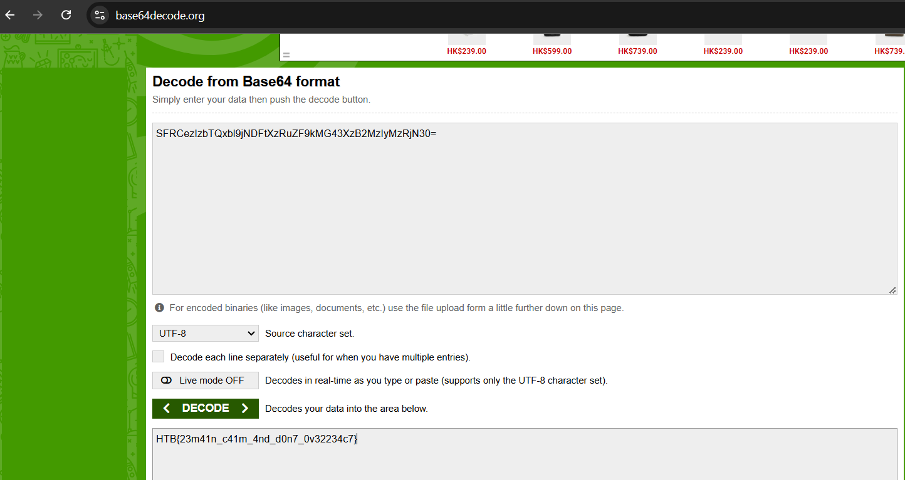

## Cat

APK file: https://github.com/h2oa/h2oa.github.io/blob/main/assets/apks/cat.ab

File được cho có extension `.ab`, đây là android backup file. Dùng tool https://github.com/nelenkov/android-backup-extractor unpack thành tar file:

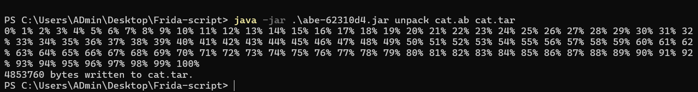

Tìm kiếm một hồi, nhận ra trong đống ảnh chỉ có 1 ảnh không phải mèo, flag ở trong ảnh này luôn:

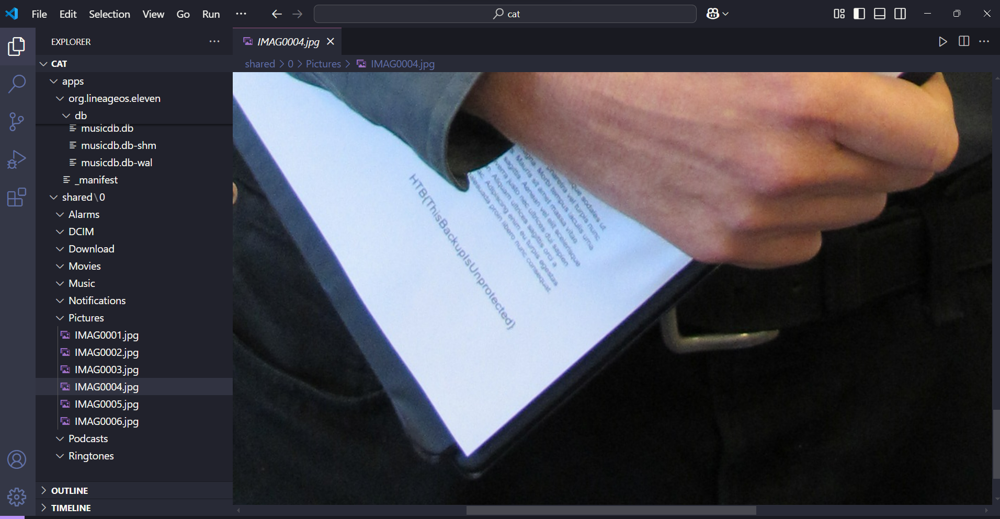

Bài này chắc muốn nói đến các file backup android `.ab` bị leak không an toàn.

## APKey

APK file: https://github.com/h2oa/h2oa.github.io/blob/main/assets/apks/APKey.apk

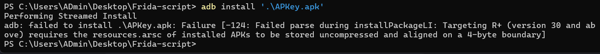

File apk ban đầu chưa align và sign, nếu install trực tiếp sẽ bị lỗi. Cần align và sign lại bằng APKTools, sau đó có thể install thành công vào android.

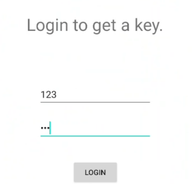

Chức năng login, quan sát code trong file apk:

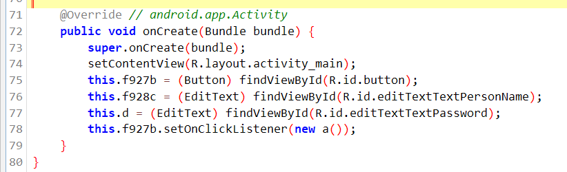

`this.f928c` là name, `this.d` là password, sau khi login hàm xử lý như sau:

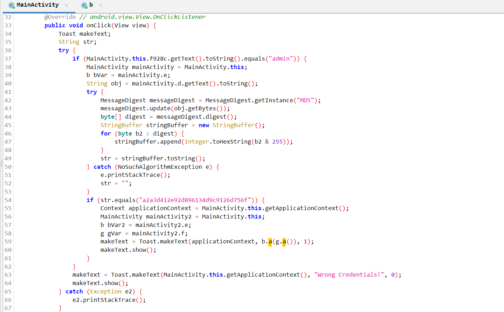

Password nhập vào qua một loạt biến đổi cần có giá trị `a2a3d412e92d896134d9c9126d756f`, thử password là `123` sẽ mã hóa thành `c4ca4238a0b92382dcc509a6f75849b`:

```
import java.security.MessageDigest;
import java.security.NoSuchAlgorithmException;

class Main {
    public static void main(String[] args) {
        String obj = "1";
        try {
            MessageDigest messageDigest = MessageDigest.getInstance("MD5");
            messageDigest.update(obj.getBytes());
            byte[] digest = messageDigest.digest();
            StringBuffer stringBuffer = new StringBuffer();
            for (byte b2 : digest) {
                stringBuffer.append(Integer.toHexString(b2 & 255));
            }
            String str = stringBuffer.toString();
            System.out.println(str);
        } catch (NoSuchAlgorithmException e) {
            e.printStackTrace();
        }
    }
}
```

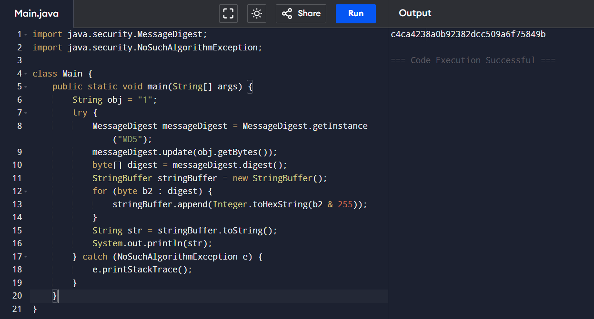

Có thể sửa smali để chuyển đoạn password mã hóa từ `a2a3d412e92d896134d9c9126d756f` sang `c4ca4238a0b92382dcc509a6f75849b`, khi đó chỉ cần nhập password `1` sẽ đúng. Decompile bằng APKTool, tìm chuỗi mã hóa ban đầu và sửa lại, compile lại là OK:

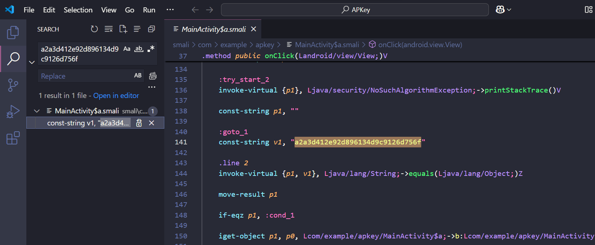

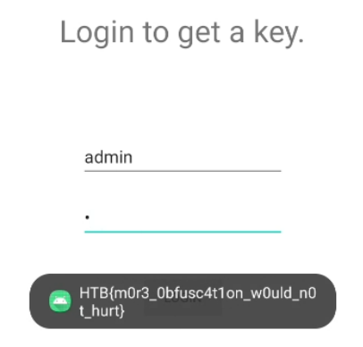

## Manager

APK file: https://github.com/h2oa/h2oa.github.io/blob/main/assets/apks/Manager.apk

Challenge này cần connect đến server, ban đầu phải nhập IP và port của machine.

Challenge gồm 2 chức năng login và register, khi register thành công có thêm chức năng update, vừa vào id đã là 5 và role member, có thể cần chiếm account id 1 hoặc role admin:

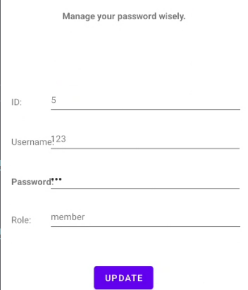

Login:

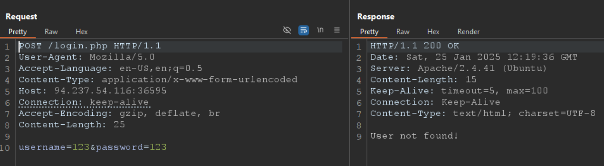

Register:

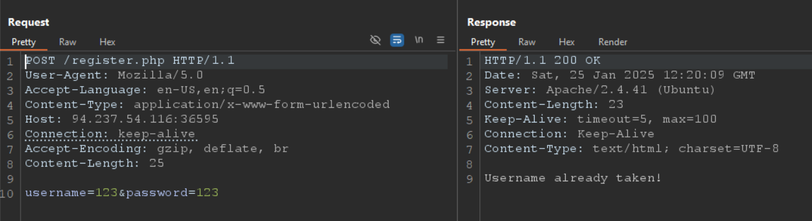

Update:

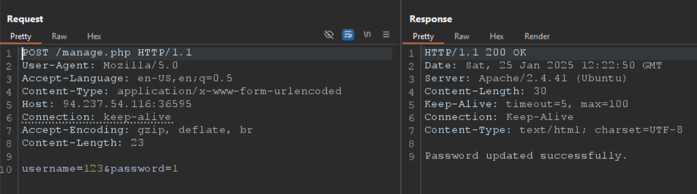

Đọc qua code không thấy có gì đặc biệt, đăng ký thử user `admin` thì đã tồn tại:

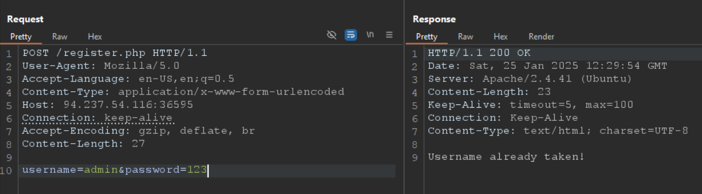

Vì `/manage.php` unauth nên có thể update password của `admin`:

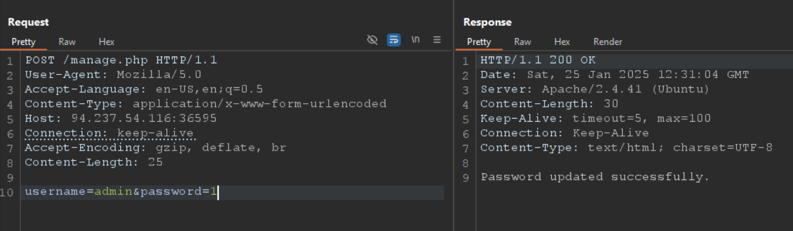

Login vào `admin` có flag:

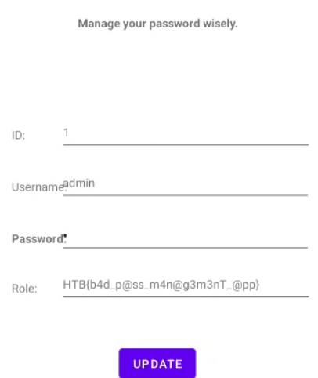

## Pinned

APK file: https://github.com/h2oa/h2oa.github.io/blob/main/assets/apks/pinned.apk

File này cũng cần align và sign lại.

Bypass SSL pinning, dùng script trên frida codeshare: https://codeshare.frida.re/@akabe1/frida-multiple-unpinning/ là xong (có dịp phải đọc kỹ cách bypass SSL pinning, mà lười quá), bắt request là có flag:

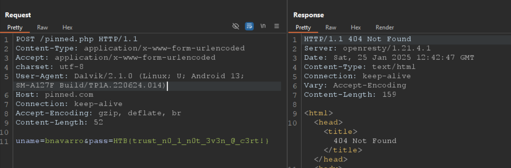