# Mở đầu

File APK đều lưu tại https://github.com/h2oa/h2oa.github.io/blob/main/assets/apks/ dạng zip, pass giải nén đều là `hackthebox`.

# I. Very Easy

## Don't Overreact

Từ tên challenge biết APK code bằng React, mở jadx xem file `index.android.bundle`:


Thấy chuỗi base64 khả nghi, decode ra flag:


# II. Easy

## Cat

File được cho có extension `.ab`, đây là android backup file. Dùng tool https://github.com/nelenkov/android-backup-extractor unpack thành tar file:


Tìm kiếm một hồi, nhận ra trong đống ảnh chỉ có 1 ảnh không phải mèo, flag ở trong ảnh này luôn:


Bài này chắc muốn nói đến các file backup android `.ab` bị leak không an toàn.

## APKey


File apk ban đầu chưa align và sign, nếu install trực tiếp sẽ bị lỗi. Cần align và sign lại bằng APKTools, sau đó có thể install thành công vào android.


Chức năng login, quan sát code trong file apk:


`this.f928c` là name, `this.d` là password, sau khi login hàm xử lý như sau:


Password nhập vào qua một loạt biến đổi cần có giá trị `a2a3d412e92d896134d9c9126d756f`, thử password là `123` sẽ mã hóa thành `c4ca4238a0b92382dcc509a6f75849b`:

```
import java.security.MessageDigest;
import java.security.NoSuchAlgorithmException;

class Main {
    public static void main(String[] args) {
        String obj = "1";
        try {
            MessageDigest messageDigest = MessageDigest.getInstance("MD5");
            messageDigest.update(obj.getBytes());
            byte[] digest = messageDigest.digest();
            StringBuffer stringBuffer = new StringBuffer();
            for (byte b2 : digest) {
                stringBuffer.append(Integer.toHexString(b2 & 255));
            }
            String str = stringBuffer.toString();
            System.out.println(str);
        } catch (NoSuchAlgorithmException e) {
            e.printStackTrace();
        }
    }
}
```


Có thể sửa smali để chuyển đoạn password mã hóa từ `a2a3d412e92d896134d9c9126d756f` sang `c4ca4238a0b92382dcc509a6f75849b`, khi đó chỉ cần nhập password `1` sẽ đúng. Decompile bằng APKTool, tìm chuỗi mã hóa ban đầu và sửa lại, compile lại là OK:


## Manager

Challenge này cần connect đến server, ban đầu phải nhập IP và port của machine.

Challenge gồm 2 chức năng login và register, khi register thành công có thêm chức năng update, vừa vào id đã là 5 và role member, có thể cần chiếm account id 1 hoặc role admin:


Login:


Register:


Update:


Đọc qua code không thấy có gì đặc biệt, đăng ký thử user `admin` thì đã tồn tại:


Vì `/manage.php` unauth nên có thể update password của `admin`:


Login vào `admin` có flag:


## Pinned

File này cũng cần align và sign lại.

Bypass SSL pinning, dùng script trên frida codeshare: https://codeshare.frida.re/@akabe1/frida-multiple-unpinning/ là xong (có dịp phải đọc kỹ cách bypass SSL pinning, mà lười quá), bắt request là có flag:


## APKrypt

Bước đầu cần align và sign lại. Ứng dụng có một chức năng duy nhất là nhập VIP code:


Có thể hook vào hàm `md5()` để trả về `735c3628699822c4c1c09219f317a8e9` hoặc sửa smali (như bài `APKey`), bài này thử dùng cách hook:

```
function main() {
    console.log("Start hooking ...");
    setTimeout(function() {
        Java.perform(function() {
            let hookMainActivity = Java.use("com.example.apkrypt.MainActivity");
			hookMainActivity.md5.implementation = function(str) {
				console.log("hooked in md5");
				var returnStr = "735c3628699822c4c1c09219f317a8e9";
				return returnStr;
			}
        });
    }, 2000);
}

setImmediate(main);
```


## FastJson and Furious

Nhập chuỗi submit xong bị out luôn khỏi ứng dụng:


Trước hết cần luồng code đi vào `if (calcHash.length() > 0)`.


Hàm `calcHash()` có kiểm tra `if (succeed)` nhưng `succeed` được set bằng `false`:


Chỉ cần hook và sửa giá trị `succeed` thành `true`, nhập vào chuỗi JSON hợp lệ pass điều kiện `parseObject.keySet().size() != 2` thì đều ra được các flag hash khác nhau (tất nhiên chưa đúng):

```
function main() {
    console.log("Start hooking ...");
    setTimeout(function() {
        Java.perform(function() {
            let hook = Java.use("hhhkb.ctf.fastjson_and_furious.MainActivity");
			hook.succeed.value = true;
			hook.calcHash.implementation = function(str) {
				console.log("hooked in calcHash");
				var flag = this.calcHash('{"a":"b", "c":"d"}');
				console.log("flag: " + flag);
				return "123";
			}
        });
    }, 2000);
}
 
setImmediate(main);
```

Chưa hiểu challenge này lắm, đọc write up thấy là CVE https://jfrog.com/blog/cve-2022-25845-analyzing-the-fastjson-auto-type-bypass-rce-vulnerability/, payload `{"@type":"hhhkb.ctf.fastjson_and_furious.Flag","success":true}`

CVE này sẽ gọi được class bất kỳ và control được thuộc tính trong class đó, nên ý tưởng sẽ gọi tới class `Flag` và set lại thuộc tính `succeed` thành true. Ủa payload là `success`, có mỗi cách giải thích ở tên hàm là `setSuccess`:


Đánh giá ý tưởng ra đề hay mà khâu flag không hay.

## Anchored

Align và sign lại trước.

README yêu cầu cài đặt trên thiết bị chưa root. Thôi bypass luôn bằng https://codeshare.frida.re/@dzonerzy/fridantiroot/

Giao diện có một chức năng duy nhất là enter email:


Trong code có nhiều đoạn trả về `Thank you for requesting early access.` , chú ý có load `libanchored.so`:


List xem trong lib này có những hàm nào:

```
Module.enumerateExports("libanchored.so", { 
    onMatch: function(e) {
        console.log("[+] Function: " + e.name + " - Address: " + e.address);
    },
    onComplete: function() {
    }
});
```

Thấy được một số hàm như `Java_com_example_anchored_MainActivity_frf`


Đây chính là mấy hàm trả về string trong code client:


List theo tiền tố `Java_com_example_anchored_MainActivity`:

```
if (e.name.startsWith("Java_com_example_anchored_MainActivity")) {
    console.log("[+] Function: " + e.name + " - Address: " + e.address);
}
```

Có được các hàm:

```
[+] Function: Java_com_example_anchored_MainActivity_c8 - Address: 0x74de5cf31c
[+] Function: Java_com_example_anchored_MainActivity_frf - Address: 0x74de5cf04c
[+] Function: Java_com_example_anchored_MainActivity_mrm - Address: 0x74de5cfee8
[+] Function: Java_com_example_anchored_MainActivity_prp - Address: 0x74de5cff94
```

Chú ý 3 hàm `frf`, `mrm`, `prp` trước trả về string, đoán là flag. Lấy giá trị trả về các hàm này:

```
var frf = Module.getExportByName('libanchored.so', 'Java_com_example_anchored_MainActivity_frf');
Interceptor.attach(frf, {
    onEnter: function(args) {
        console.log('Inside frf ...');
    },
    onLeave: function(retval) {
        console.log('ftf returned: ' + retval);
    }
});
// tương tự với mrm, prp
```

Không có gì đặc sắc ...


Đọc lại mô tả có thể phải intercept http request? bypass SSL pinning? Merge script codeshared trên với https://codeshare.frida.re/@akabe1/frida-multiple-unpinning/ bắt được request, chứa flag luôn:


# III. Medium

## Cryptohorrific

Giải nén xong ra một đống file không hiểu gì:


Cấu trúc thư mục:

```
└───hackthebox.app
    ├───Base.lproj
    │   ├───LaunchScreen.storyboardc
    │   └───Main.storyboardc
    └───_CodeSignature
```

Hỏi chatgpt mới rõ đây là cấu trúc file IOS, có lẽ cần chuyển sang `.ipa` để cài app. Tìm mãi không tải nối cái ios emulator nào ... thôi dẹp.

Cũng chú ý tới file `challenge.plist` rất giống flag đã encrypt, chắc phải rev:


Dùng tool `plistutil` có thể chuyển các file `.plist` thành `.xml` cho dễ đọc:


Flag đã được encrypt `Tq+CWzQS0wYzs2rJ+GNrPLP6qekDbwze6fIeRRwBK2WXHOhba7WR2OGNUFKoAvyW7njTCMlQzlwIRdJvaP2iYQ==`. Tìm thấy `key` và `IV` trong file `challenge` sau khi reverse:


## SeeTheSharpFlag

Align và sign lại, vẫn không install được, mở jadx ra thấy có mỗi native lib cấu trúc x86, chắc đây là lý do? (có lẽ cũng vì vậy mà tên file là `com.companyname.seethesharpflag-x86`), liệu có thể build thêm lib arm64 không nhỉ?

Chú ý tới các file `.dll` vì đề bài gợi ý C#, quan sát thấy file `SeeTheSharpFlag.dll` khả nghi. Reverse bằng dnSpy không hiểu sao không được, dùng tool https://github.com/NickstaDB/xamarin-decompress decompile rồi mở bằng dotPeek:


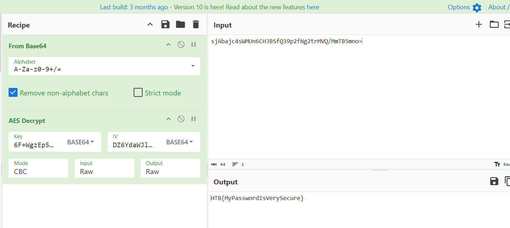

Bài này dạy reverse file `.dll`, chắc vậy.

## SAW

Cài xong ứng dụng không bấm được, thử frida spawn lên được nhưng ứng dụng không mở lên:

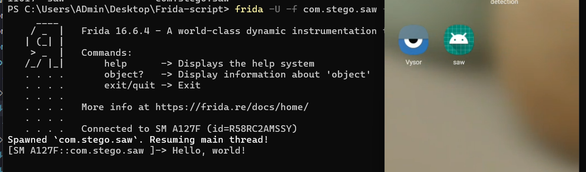

Có vẻ trước hết cần bypass 2 điều kiện if đầu tiên:

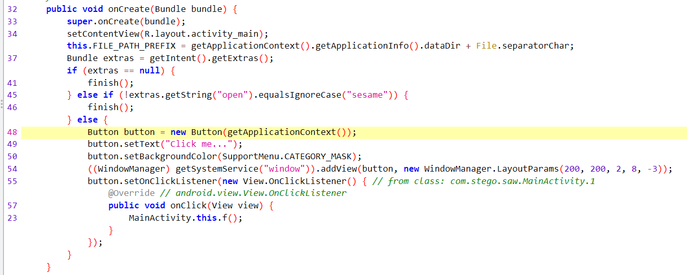

Có thể truyền data với Intent với:

```
adb shell am start -n com.stego.saw/com.stego.saw.MainActivity -e open sesame
```

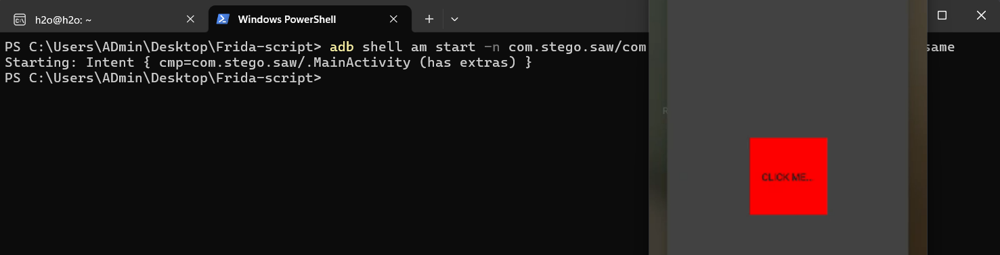

Click thì crash tiếp, check adb log:

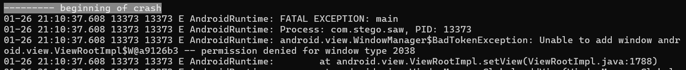

Lỗi này là do ứng dụng mở một cửa số cần quyền `SYSTEM_ALERT_WINDOW` nhưng không được cấp, kiểm tra quyền và cấp lại:

```
adb shell appops get com.stego.saw SYSTEM_ALERT_WINDOW
adb shell appops set com.stego.saw SYSTEM_ALERT_WINDOW allow
```

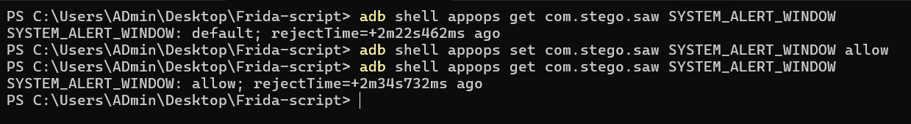

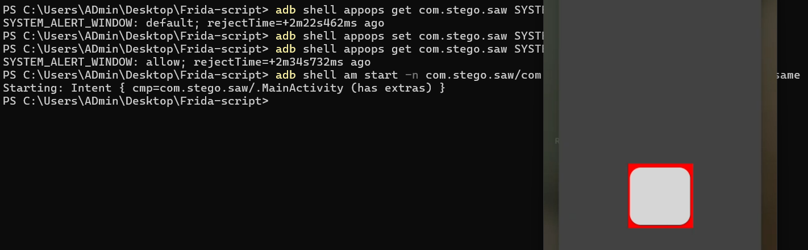

Lúc này ứng dụng có thể hoạt động bình thường, yêu cầu nhập để XOR:

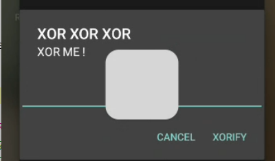

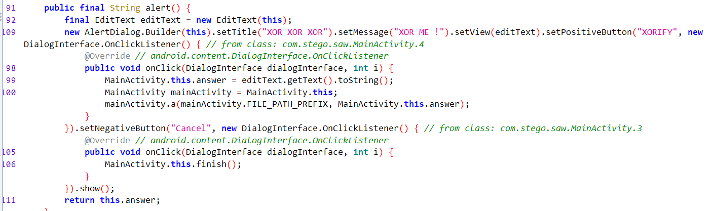

Hàm `a()` load từ `libdefault`:

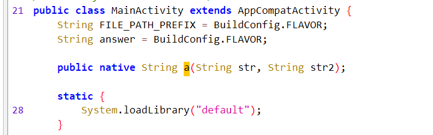

List các hàm load từ lib này không thấy có gì đặc biệt:

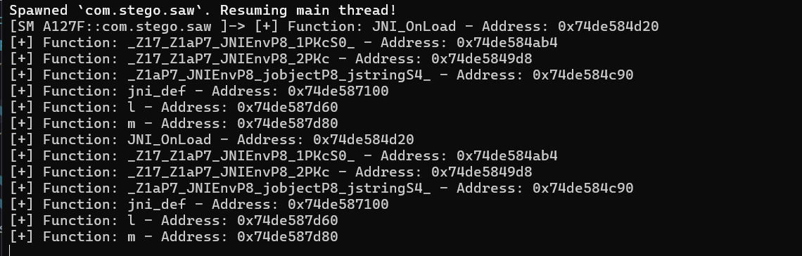

Reverse nhìn thấy hàm `a()`, chuyển sang code C bằng F5:

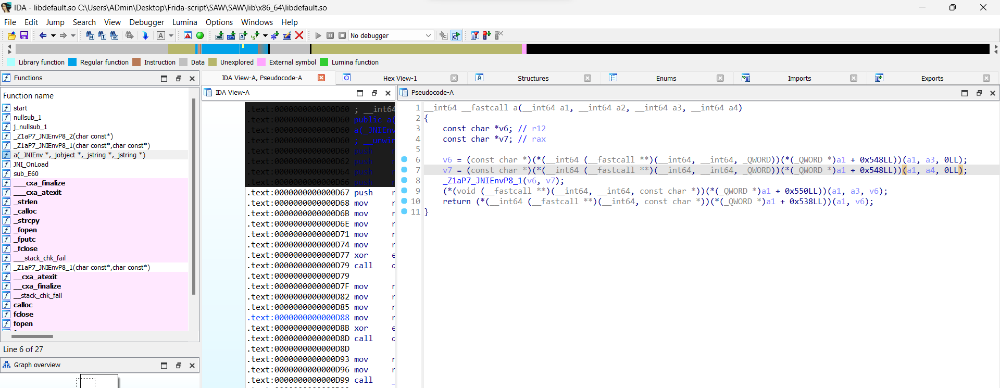

Hàm này nhận vào hai tham số `FILE_PATH_PREFIX` và `answer` là kết quả chúng ta nhập vào, lúc này trở thành `v6`, `v7`, gọi tới hàm `_Z1aP7_JNIEnvP8_1()` nhận vào tham số `v6`, `v7`:

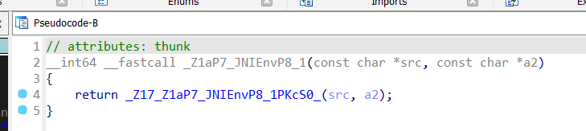

Gọi tới `_Z17_Z1aP7_JNIEnvP8_1PKcS0_`, `v6`, `v7` trở thành `src`, `a2`, trong này XOR (từng byte) `a2` với `l` kiểm tra điều kiện có bằng `m` hay không:

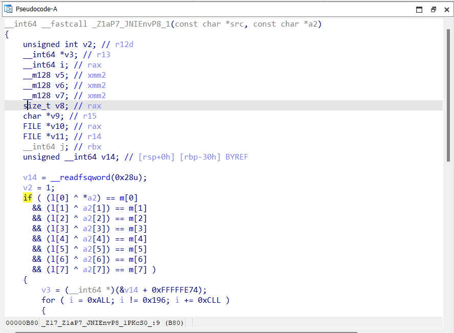

Trace tìm được `l` và `m`:

```
l = {0x0A, 0x0B, 0x18, 0x0F, 0x5E, 0x31, 0x0C, 0x0F}
m = {0x6C, 0x67, 0x28, 0x6E, 0x2A, 0x58, 0x62, 0x68}
```

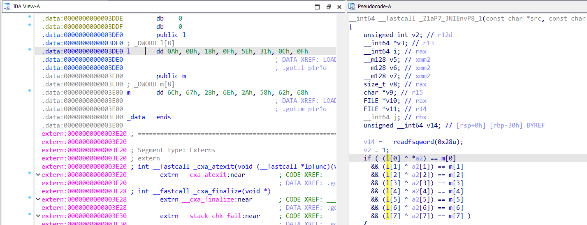

Tính ngược lại được `a2` (hay `answer`) phải là `fl0ating`:

```python
# python
l = [0x0A, 0x0B, 0x18, 0x0F, 0x5E, 0x31, 0x0C, 0x0F]
m = [0x6C, 0x67, 0x28, 0x6E, 0x2A, 0x58, 0x62, 0x68]

for i in range(8):
  print(chr(l[i] ^ m[i]), end = "")
```

Tưởng nhập xong là ra flag nhưng chưa ...

Đưa đoạn code sau cho chatgpt đọc (lẽ ra phải tự đọc mà trình rev kém quá) thì được biết sẽ ghi một cái gì đó (khả năng là flag) ra file (liên quan tới tham số thứ nhất trong hàm `a()`).

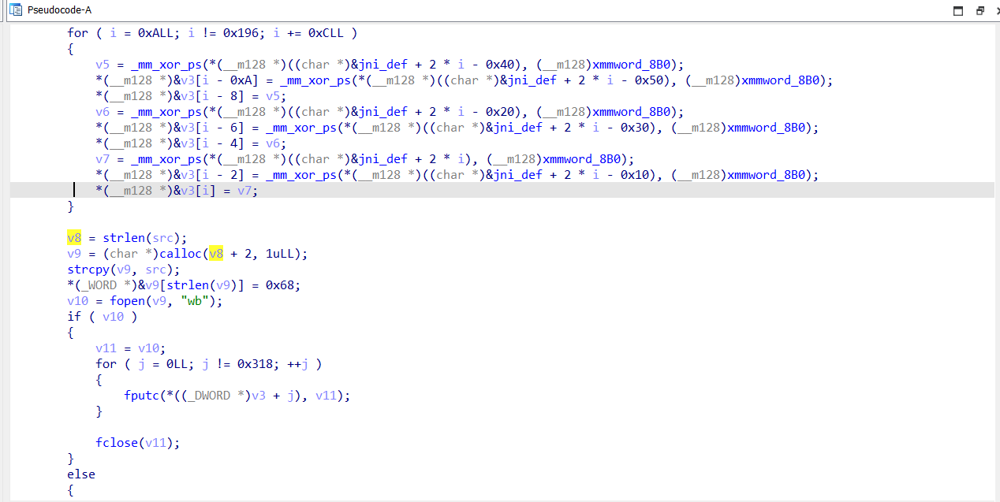

Tới đây nghĩ đến dùng `nm` đọc địa chỉ hàm `a()` vì nãy dùng `Module.enumerateExports` không tìm được hàm này.

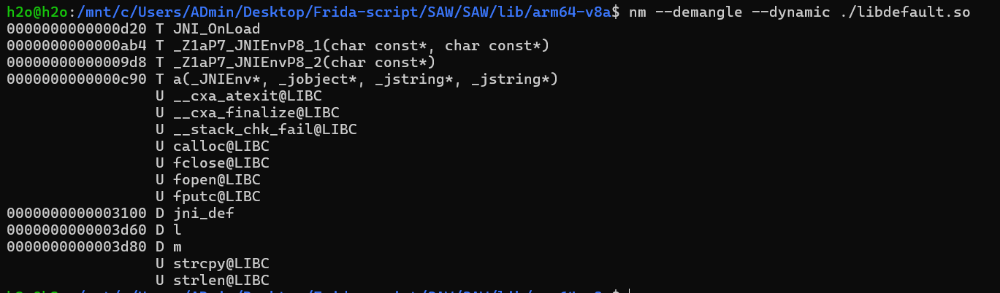

Hook xong cũng không đọc được tham số thứ nhất ...

Nghiên cứu kỹ lại đoạn code:

```
v8 = strlen(src);
v9 = (char *)calloc(v8 + 2, 1uLL);
strcpy(v9, src);
*(_WORD *)&v9[strlen(v9)] = 0x68;
```

ChatGPT bảo `v9 = src + 0x68 + 0x00`, 0x69 là ký tự `h`, `0x00` kết thúc chuỗi. Như vậy file được viết kết thúc bằng `h` :)))))

Nhanh trí hook vào hàm `a()` xem tham số thứ nhất, không được, chuyển sang `_Z1aP7_JNIEnvP8_1(v6, v7);` thì tìm được, nhờ chatgpt code phần chuyển từ đọc tham số string sang tham số byte:

```
Java.perform(function() {
	console.log("Start hooking ...");
	var baseAddr_a = Module.findBaseAddress("libdefault.so");
	var FuncAddr_a = baseAddr_a.add(0xab4);
	Interceptor.attach(FuncAddr_a, {
		onEnter: function(args) {
			var byteArray0 = Memory.readByteArray(args[0], 32);
			var uint8Array = new Uint8Array(byteArray0);
			var hexString = '';
                for (var i = 0; i < uint8Array.length; i++) {
                    hexString += uint8Array[i].toString(16).padStart(2, '0') + ' ';
                }
            console.log('Bytes 0: ' + hexString);
		},
		onLeave: function(retval) {
		}
	});
});
```

Chạy frida trước ở tab 1, mở tab 2 chạy tiếp `adb shell am start -n com.stego.saw/com.stego.saw.MainActivity -e open sesame` (gặp lỗi thì save lại code frida 1 lần nữa), nhập input thu được chuỗi byte đầu vào:

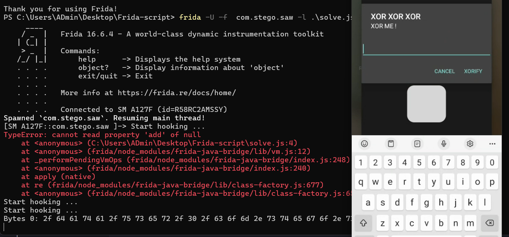

Decode ra đường dẫn `/data/user/0/com.stego.saw/`:

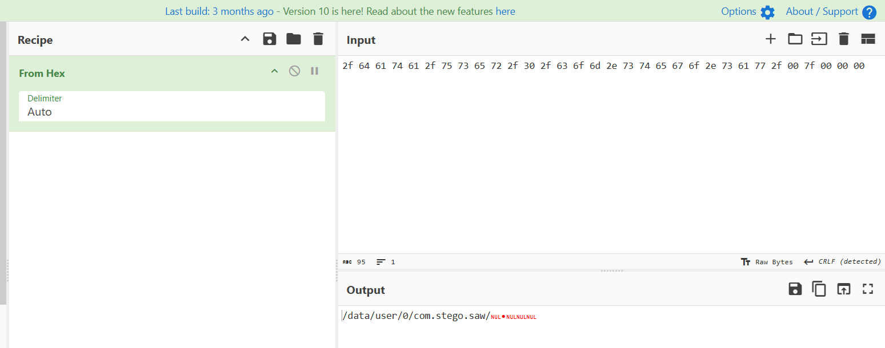

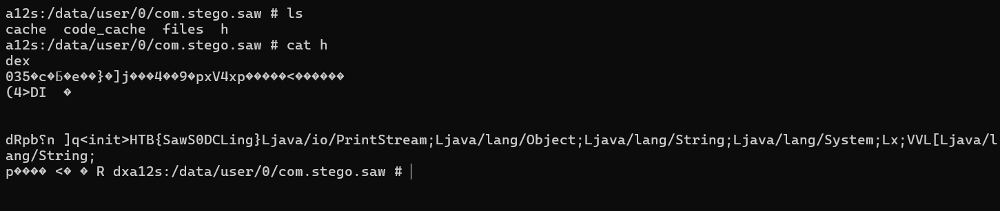

## Investigator

Nhận được một file backup và folder system:

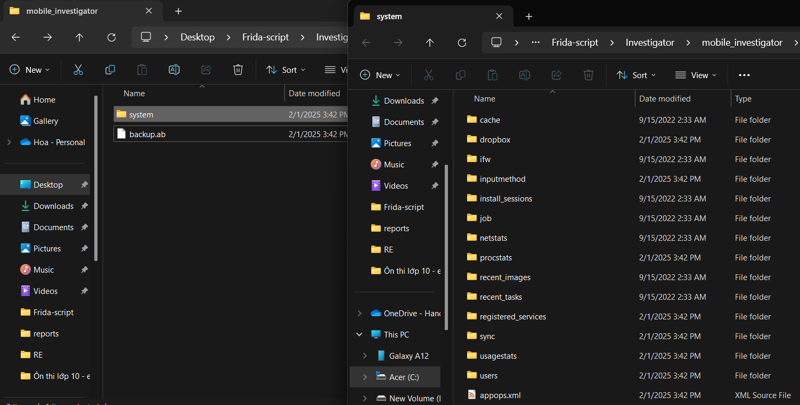

Unpack file backup `backup.ab` thành tar file trước nhưng có password:

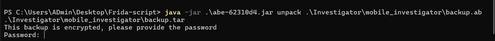

