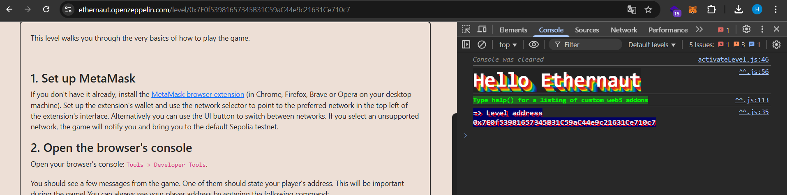

# I. Mở đầu

Lướt web lung tung vô tình nhìn thấy mấy web liên quan tới smart contract bug bounty. Cũng muốn học thêm, đọc thêm mấy blog thì quyết định bắt đầu từ CTF, ít nhất quen thuộc với format CTF, còn kiến thức smart contract thì ... số 0. Học qua Solidity https://www.tutorialspoint.com/solidity/ biết code cơ bản. Tính phá đảo https://www.damnvulnerabledefi.xyz/ thì mất đống thời gian mãi không hiểu và dựng được môi trường lên :))) cuối cùng phát hiện một trang basic hơn https://ethernaut.openzeppelin.com/

# II. https://ethernaut.openzeppelin.com/

## 1. Level 0 - Hello Ethernaut

Level này chủ yếu là hướng dẫn kiến thức basic + dựng môi trường, ngon!

Setup extension xong chọn network test `SepoliaETH`, xong vào lại https://ethernaut.openzeppelin.com/ để connect ví.

Claim test SepoliaETH:

- https://www.ethereumsepoliafaucet.com/
- https://cloud.google.com/application/web3/faucet/ethereum/sepolia
- https://faucets.chain.link/
- https://access.rockx.com/faucet-sepolia
- https://www.coingecko.com/learn/sepolia-eth