# I. Mở đầu

Mới chuyển sang môi trường mới được một thời gian ngắn, nhìn lại thấy bản thân còn quá lười và cần cần học thêm nhiều thứ vì nơi làm việc mới cũng thoải mái thời gian, nếu không học thêm thì ... chắc còn cái nịt. Vô tình trong lúc tìm cách bypass frida detection tìm được blog https://eternalsakura13.com/2020/07/04/frida/ đầy đủ và hay quá! Cũng là cảm hứng để xây một blog cho riêng mình, củng cố kiến thức, ghi lại cái mới học được, tự giám sát bản thân để không lười biếng nữa. Học lại frida thôi ...

# II. Cài đặt môi trường

Thực ra trước giờ chưa từng thực sự hiểu frida là gì, tóm gọn lại thì nó giúp "hook" vào các hàm trong mobile và có thể sửa lại logic trong hàm đó trước khi nó được gọi, vi diệu! Về phần này có thể đọc thêm blog của anh Nhật, vẫn hay lên đọc đi đọc lại mỗi khi cần: https://viblo.asia/p/hook-android-java-voi-frida-EbNVQZrb4vR. Rất tuyệt cho người mới như mình.

Frida cần cài đặt ở 2 bên: frida server và frida client. Và version 2 bên phải giống nhau.

Frida server cài trong điện thoại, repo https://github.com/frida/frida/releases. Muốn biết điện thoại dùng arm64 hay x86 check `uname -m`:

```
"aarch64" is 64-bit ARMv8-A, which is Android's "arm64-v8a" ABI.
"armv7l" is 32-bit ARMv7-A, which is Android's "armeabi-v7a" ABI.
"x86_64" is 64-bit x86, which is Android's "x86_64" ABI.
"i386" or "i686" are the basic 32-bit x86 or the Pentium Pro variant respectively, which is Android's "x86" ABI.
```

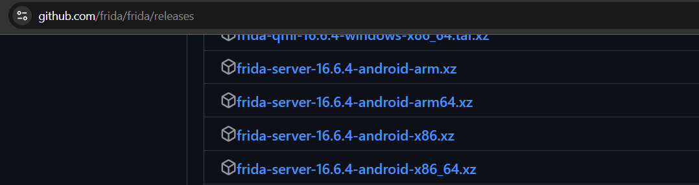

Thường hay `adb push` vào `data/local/tmp`, rồi chạy frida server lên thôi `./frida-server-name &`, dấu `&` cho chạy ngầm:

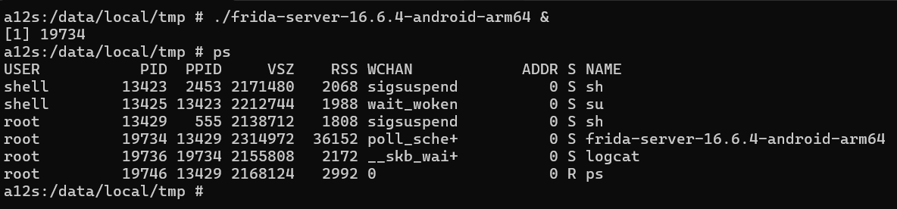

Listen port `-l 0.0.0.0:1337`, chưa rõ tác dụng, chắc sau dùng để debug.

Frida client cài trong môi trường máy tính:

```
pip3 install frida-tools
frida --version
frida-ps --version
```

Cài version theo ý muốn:

```
pip3 install frida==16.6.4
```

# III. Frida cơ bản

Check các package apk đang chạy `frida-ps -Ua`:

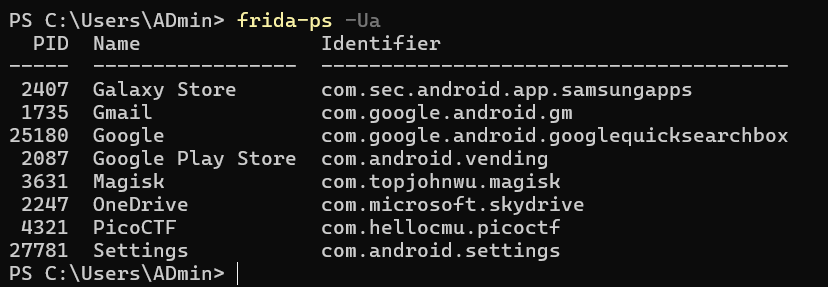

Chương trình đơn giản spawn ứng dụng:

```
Java.perform(function x() {
    console.log("hello")
})
```

```
frida -U -f <package.name> -l <frida.js>
```

Chạy và in ra console "hello":

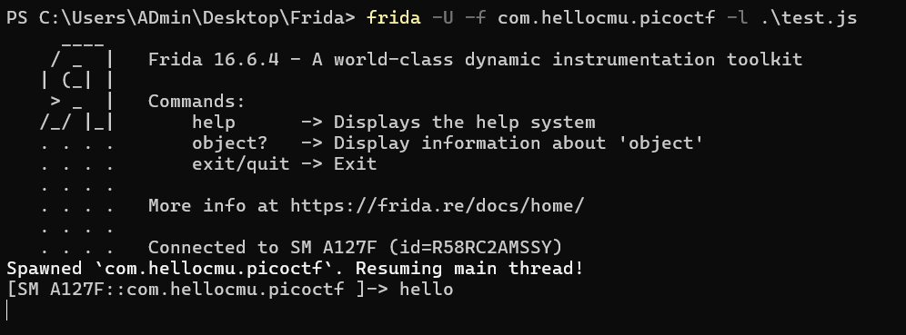

# IV. Một vài bài CTF luyện tập

## PicoCTF - droids1

apk file: https://github.com/h2oa/h2oa.github.io/tree/master/assets/ctf/one.apk

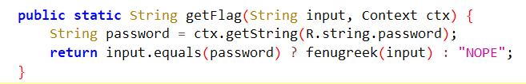

Hàm `getFlag()` so sánh input nhập vào với `String password = ctx.getString(R.string.password);`, nếu giống sẽ trả về flag (lấy từ lib `hellojni`). Dùng frida hook vào hàm `getFlag()` để in ra giá trị `password`. Chuyển đoạn Java `String password = ctx.getString(R.string.password);` sang js:

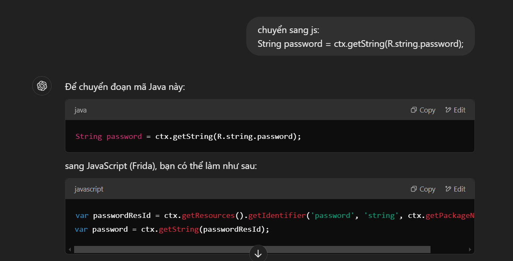

```
var passwordResId = ctx.getResources().getIdentifier('password', 'string', ctx.getPackageName());
var password = ctx.getString(passwordResId);
```

Frida script:

```
Java.perform(function () {
    console.log("Start hooking ...");
    var FlagstaffHill = Java.use('com.hellocmu.picoctf.FlagstaffHill');
    FlagstaffHill.getFlag.implementation = function(input, ctx) {
        var passwordResId = ctx.getResources().getIdentifier('password', 'string', ctx.getPackageName());
        var password = ctx.getString(passwordResId);
        console.log("password: ", password);
        var result = this.getFlag(input, ctx);
        return result;
    };
});
```

Có thể hook không thành công vì khi `Java.perform()` được gọi thì ứng dụng chưa sẵn sàng, có thể giải quyết bằng cách đợi 2 giây rồi mới thực hiện, lúc này ứng dụng sẵn sàng sẽ hook thành công được:

```
function main() {
    console.log("Start hooking ...");

    setTimeout(function() {
        Java.perform(function() {
            var FlagstaffHill = Java.use("com.hellocmu.picoctf.FlagstaffHill");
            FlagstaffHill.getFlag.implementation = function(input, ctx) {
                var passwordResId = ctx.getResources().getIdentifier('password', 'string', ctx.getPackageName());
                var password = ctx.getString(passwordResId);
                console.log("password: ", password);
                var result = this.getFlag(input, ctx);
                return result;
            }
        });
    }, 2000);
}

setImmediate(main);
```

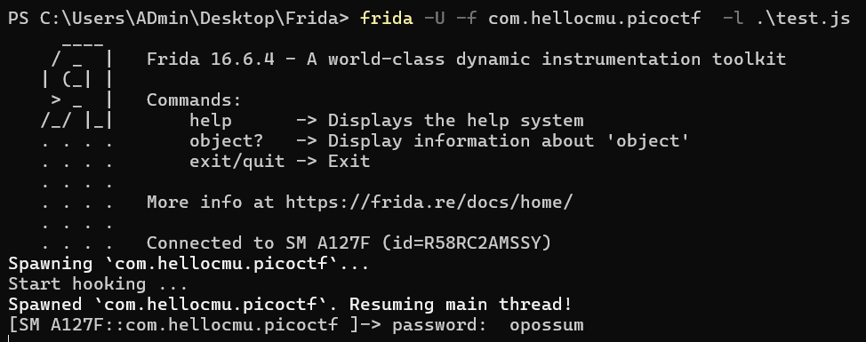

Một cách khác là hook vào hàm `Context.getString()`:

```
Java.perform(function() {
    var Context = Java.use("android.content.Context");
    Context.getString.overload('int').implementation = function(resId) {
        var result = this.getString(resId);
        console.log("resId: ", resId, " result: ", result);
        return result;
    }
})
```

## PicoCTF - droids4

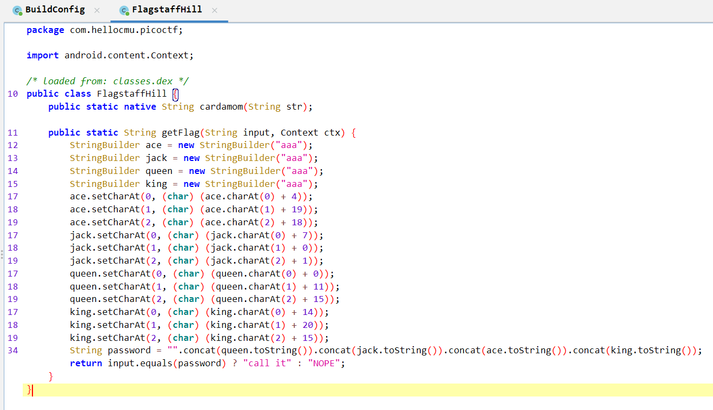

Reverse đoạn code lấy password có thể nhờ chatgpt, thu được password `alphabetsoup`:

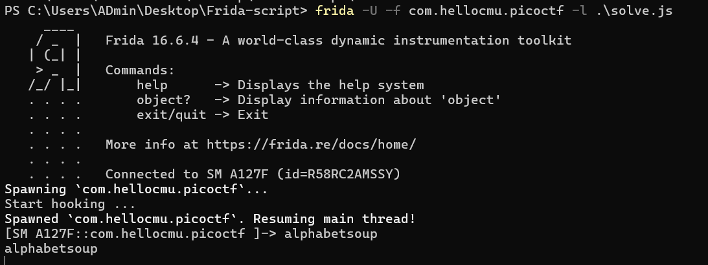

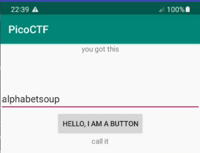

Nhập xong chỉ trả về "call it" vì `return input.equals(password) ? "call it" : "NOPE";`. Lẽ ra khi password đúng cần trả về hàm `cardamom(password)`. Frida hook hàm `getFlag()` rồi gọi hàm `cardamom()` trong đó với input là `password` tìm được ở trên rồi in ra thôi:

```
function main() {
    console.log("Start hooking ...");

    setTimeout(function() {
        Java.perform(function() {
            var FlagstaffHill = Java.use("com.hellocmu.picoctf.FlagstaffHill");
            FlagstaffHill.getFlag.implementation = function(input, ctx) {
                var password = "alphabetsoup";
                var flag = FlagstaffHill.cardamom(password);
                console.log(flag);
                var result = this.getFlag(input, ctx);
                return result;
            }
        });
    }, 2000);
}

setImmediate(main);
```

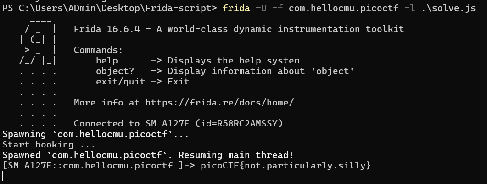

# Lưu lại vài link

Paste image và tự lưu vào folder custom: https://www.youtube.com/watch?v=L6KKzbVD-Y8