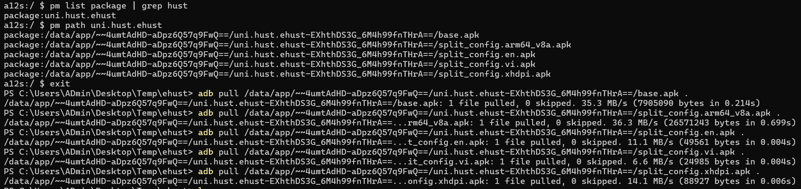
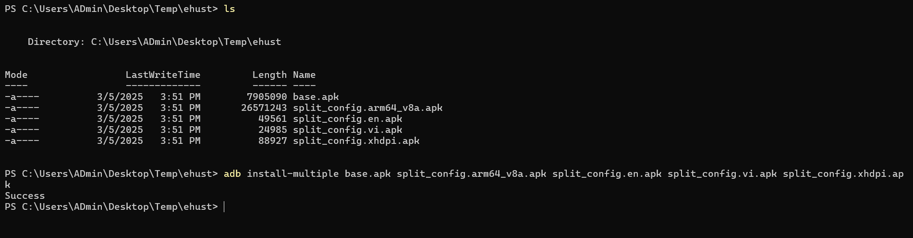

# I. Mở đầu

Có được file apk chắc chắn giúp phân tích các hành vi của ứng dụng dễ dàng hơn. Ghi lại một số cách lấy file apk từ ứng dụng. Tập trung chủ yếu android trước, ios tìm hiểu sau ...

# II. Command

Với các app tải từ CHPlay về, có thể dùng lệnh trích xuất apk. Mang luôn ehust ra test.

Tìm được path của ứng dụng xong, pull hết file apk về:

Trường hợp này ứng dụng sử dụng Android App Bundles nên có các các split apks (bao gồm `base.apk` và các `split_config.*.apk`). Muốn install lại cần dùng `adb install-multiple` thay vì install bình thường:

Khi phân tích app bằng jadx, base.apk chứa code java, kotlin, ... các lib .so nằm trong file `split_config.<structure>.apk`.