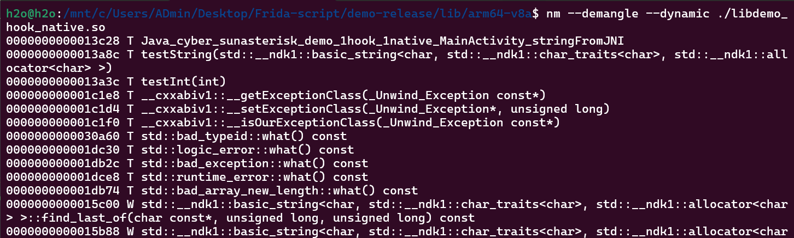

# I. Mở đầu

Done phần frida cơ bản, cũng biết hook cơ bản vào các hàm rồi. Lướt qua lại các bài viết thì nhận ra phần Native code kiểu gọi các lib `.so` chưa biết cách hook (các hàm nằm trong lib mà, thực ra app Momo cũng dùng Vkey detect frida trong lib, có dịp sẽ tìm hiểu kỹ hơn). Tiện được biết đến 2 bài viết của anh Nhật (https://viblo.asia/p/hook-android-native-phan-1-yZjJYjjpLOE), làm theo trước đã, đồng thời cũng bổ sung thêm kiến thức qua chuỗi bài viết https://eternalsakura13.com/2020/07/04/frida/.

# II. Frida với Native

Nhìn lại các bài CTF (chẳng hạn bài one.apk của PicoCTF), trong class `MainActivity` hay có đoạn code gọi thư viện `System.loadLibrary()` chính là đang gọi các lib `.so` Native. Như hình dưới thì gọi lib `hellojni.so` trong `Resources/lib/x86_64` (có thể gọi các lib khác tùy kiến trúc), lưu ý tên lib được ghép tiền tố `lib` vào:


Mượn cái sơ đồ cho dễ hình dung:


Sau này trình reverse tốt hơn sẽ có thêm các bài viết liên quan reverse các lib này, giờ cứ học mấy kỹ thuật hook trước đã.

App demo (mượn luôn): https://github.com/h2oa/h2oa.github.io/blob/main/assets/apks/demo-release.apk

Mở app ra thấy button, bấm vào hiện thông điệp hello, chuỗi message này lấy từ trong lib `libdemo_hook_native.so`


## 1. Hook vào Java

Bước đầu tiên, hook để thay đổi message này, đơn giản là thay đổi return của `stringFromJNI()`:

```
let hookStringFromJNI = Java.use("cyber.sunasterisk.demo_hook_native.MainActivity");
hookStringFromJNI.stringFromJNI.implementation = function () {
    let newMessage = "Hooked successfully";
    return newMessage;
};
```


## 2. Hook vào Native với API `Interceptor.attach`

Bắt đầu kiến thức mới rồi. API dùng để hook là `Interceptor.attach` nhận tham số là địa chỉ của hàm cần hook trong bộ nhớ android, có 2 event:

- Event `onEnter`: Thực thi khi hook vào hàm thành công, lúc này đọc tham số truyền vào được.
- Event `onLeave`: Thực thi khi kết thúc quá trình hook vào hàm, thay đổi được giá trị return.

Đoạn js hook như sau, `addressFunctionHook` là địa chỉ hàm cần hook, cần tìm được địa chỉ này:

```
Interceptor.attach(addressFunctionHook, {
    onEnter: function(args) {
        console.log('Inside stringFromJNI...');
    },
    onLeave: function(retval) {
        const retStr = Java.vm.getEnv().newStringUtf("Hooked Native successfully!");
        retval.replace(retStr);
    }
});
```

### 2.1. Tìm địa chỉ với `Module.getExportByName()`

```
var addressStringFromJNI = Module.getExportByName('libdemo_hook_native.so', 
    'Java_cyber_sunasterisk_demo_1hook_1native_MainActivity_stringFromJNI');
```

Hàm `Module.getExportByName()` với tham số 1 là tên lib .so chứa hàm cần hook, tham số 2 là tên hàm cần hook, theo cú pháp (Do package có ký tự `_` nên được chuyển thành `_1`):


Cách tìm địa chỉ này cần biết chính xác tên hàm cần hook, đôi khi chúng ta không biết điều đó (có thể do quá trình biên dịch tên hàm không chính xác), nên cần học thêm cách hook dựa theo địa chỉ hàm.

### 2.2. API `enumerateExports()`

API `enumerateExports()` cho phép xem toàn bộ hàm được tải từ lib, chúng ta quan tâm hai yếu tố tên hàm và địa chỉ trong bộ nhớ. Thử xem toàn bộ hàm tải từ `libdemo_hook_native.so`:

```
Module.enumerateExports("libdemo_hook_native.so", { 
    onMatch: function(e) {
        console.log("[+] Function: " + e.name + " - Address: " + e.address);
    },
    onComplete: function() {
    }
});
```

Nhiều thật ... Trong đống hàm trả về cũng có chứa `stringFromJNI()` vừa nãy hook:


Mỗi lần chạy lại thì địa chỉ hàm `Java_cyber_sunasterisk_demo_1hook_1native_MainActivity_stringFromJNI` cũng thay đổi, do base address thay đổi, còn offset không thay đổi. Lưu ý địa chỉ trong hình trên (hay lấy từ API Module.enumerateExports) là `base + offset`


Tối ưu thêm lệnh `if (e.name == "Java_cyber_sunasterisk_demo_1hook_1native_MainActivity_stringFromJNI")` để chỉ in ra hàm cần hook:


### 2.3. Lệnh `nm`

Lệnh `nm` có thể lấy được offset address của hàm cần hook. Trước hết decompile apk file trước, rồi dùng cú pháp:

```
nm --demangle --dynamic <đường-dẫn-tới-file-thư-viện>
```


Lưu ý `nm` phải chạy đúng lib tương ứng với kiến trúc android, trong trường hợp này phải chạy với kiến trúc `arm64-v8a` (bảo sao nãy giờ so sánh hai phương pháp địa chỉ không giống nhau):



Như hình trên thấy được offset của hàm `stringFromJNI` là `0x13c28`.

Kết hợp API `Module.findBaseAddress()` thì tính toán được địa chỉ hàm cần hook:

```
var baseAddr = Module.findBaseAddress("libdemo_hook_native.so");
var FuncAddr = baseAddr.add(0x13c28);
```

### 2.4. API `DebugSymbol.fromName` và `DebugSymbol.findFunctionsMatching`

API `DebugSymbol.fromName` giúp tìm địa chỉ hàm qua debug symbol, có thể từ log, có thể từ lệnh `nm`, ví dụ với debug symbol có được từ `nm` là `Java_cyber_sunasterisk_demo_1hook_1native_MainActivity_stringFromJNI`:

```
var FuncAddr = DebugSymbol.fromName('Java_cyber_sunasterisk_demo_1hook_1native_MainActivity_stringFromJNI').address;
```

API `DebugSymbol.findFunctionsMatching` tìm theo regex (cần đoán một chút):

```
var FuncAddr = DebugSymbol.findFunctionsMatching('*stringFromJNI*');
```

### 2.5. Kết quả hook

So sánh tất cả phương pháp trên cho chắc:


Tất cả đều giống nhau, hook thử thôi:

```
function main() {
    console.log("Start hooking ...");
    setTimeout(function() {
        Java.perform(function() {
            var stringFromJNI = Module.getExportByName('libdemo_hook_native.so', 
                'Java_cyber_sunasterisk_demo_1hook_1native_MainActivity_stringFromJNI');
            console.log("Address with Module.getExportByName: " + stringFromJNI);
            var baseAddr = Module.findBaseAddress("libdemo_hook_native.so");
            var FuncAddr = baseAddr.add(0x13c28);
            console.log("Address with nm: " + FuncAddr);
            Module.enumerateExports("libdemo_hook_native.so", { 
                onMatch: function(e) {
                    if (e.name == "Java_cyber_sunasterisk_demo_1hook_1native_MainActivity_stringFromJNI") {
                        console.log("[+] Function (with Module.enumerateExports): " + e.name + " - Address: " + e.address);
                    }
                }, 
                onComplete: function() { 
                }
            });
            var FuncAddr = DebugSymbol.fromName('Java_cyber_sunasterisk_demo_1hook_1native_MainActivity_stringFromJNI').address;
            console.log("Address with DebugSymbol.fromName: " + FuncAddr);
            var FuncAddr1 = DebugSymbol.findFunctionsMatching('*stringFromJNI*');
            console.log("Address with DebugSymbol.findFunctionsMatching: " + FuncAddr1);
            let addressAll = {
                "test": "0x77187a6c28"
            };
            var addressAllPointer = ptr(addressAll.test);
            Interceptor.attach(addressAllPointer, {
                onEnter: function(args) {
                },
                onLeave: function(retval) {
                    var retStr = Java.vm.getEnv().newStringUtf("Hooked Native successfully!");
                    retval.replace(retStr);
                }
            });
        });
    }, 2000);
}

setImmediate(main);
```


## 3. Thay đổi args truyền vào hàm

Nãy giờ hook vào phần return của `stringFromJNI`, giờ cụ thể muốn hook vào hàm `testString()` và xem tham số truyền vào, thay đổi tham số truyền vào.

Liệt kê tham số truyền vào:

```
var baseAddr = Module.findBaseAddress("libdemo_hook_native.so");
var FuncAddr = baseAddr.add(0x13a8c);
Interceptor.attach(FuncAddr, {
    onEnter: function(args) {
        console.log('Args 0: ' + Memory.readUtf8String(args[0]));
        console.log('Args 1: ' + Memory.readUtf8String(args[1]));
    },
    onLeave: function(retval) {
    }
});
```


Chưa hiểu vì sao args 0 và 1 đều là "Hello from C++" ...

Muốn thay đổi tham số truyền vào thì trong event `onLeave` gọi lại hàm một lần nữa với tham số mới (ý tưởng cũng giống bài viết hook cơ bản), chưa hiểu vì sao phải thừa một dấu cách ở trước args mới?

```
function main() {
    console.log("Start hooking ...");
    setTimeout(function() {
        Java.perform(function() {
            var baseAddr = Module.findBaseAddress("libdemo_hook_native.so"); 
            var FuncAddr = baseAddr.add(0x13a8c);
            var testStringNew = new NativeFunction(ptr(FuncAddr), 'pointer', ['pointer']);
            Interceptor.attach(FuncAddr, {
                onEnter: function(args) {
                    console.log('Args 0: ' + Memory.readUtf8String(args[0]));
                    console.log('Args 1: ' + Memory.readUtf8String(args[1]));
                },
                onLeave: function(retval) {
                    const argNew = Memory.allocUtf8String(" hooked new");
                    testStringNew(argNew).readUtf8String();
                }
            });
        });
    }, 2000);
}

setImmediate(main);
```