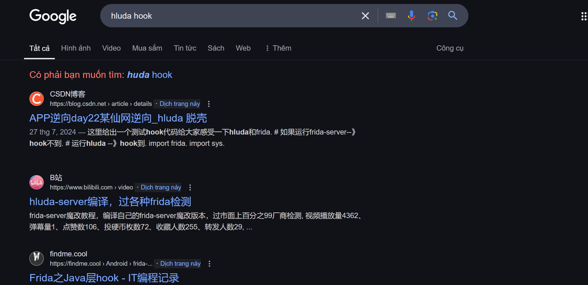
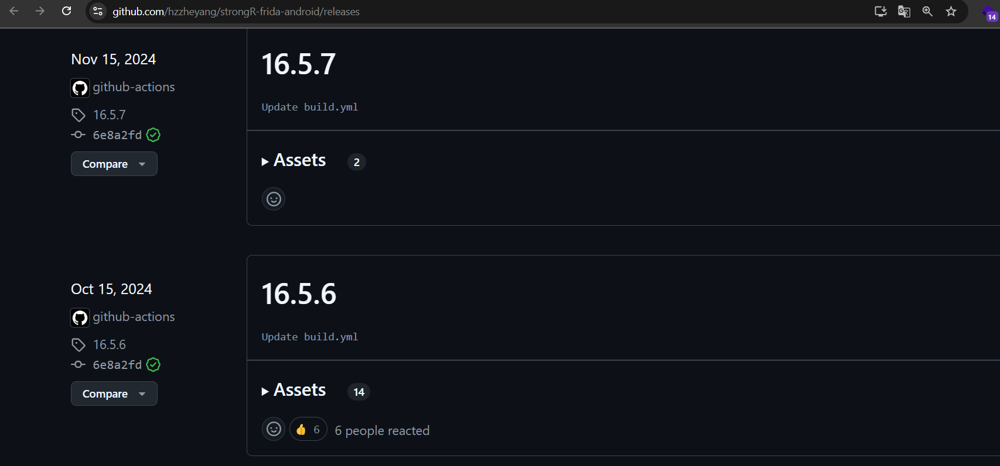
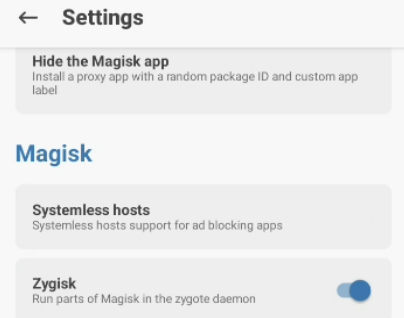
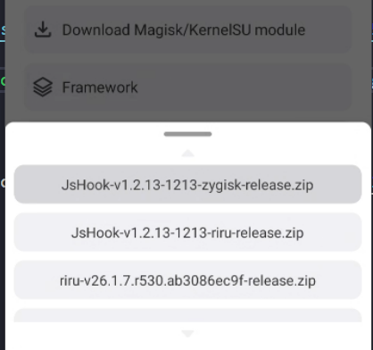
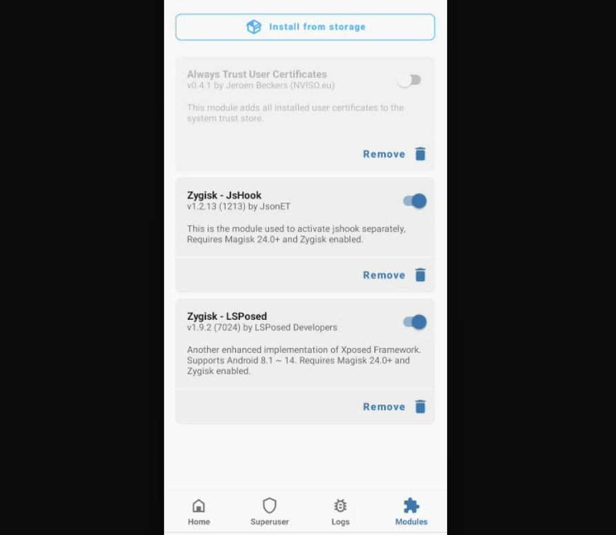
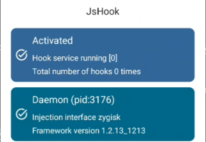
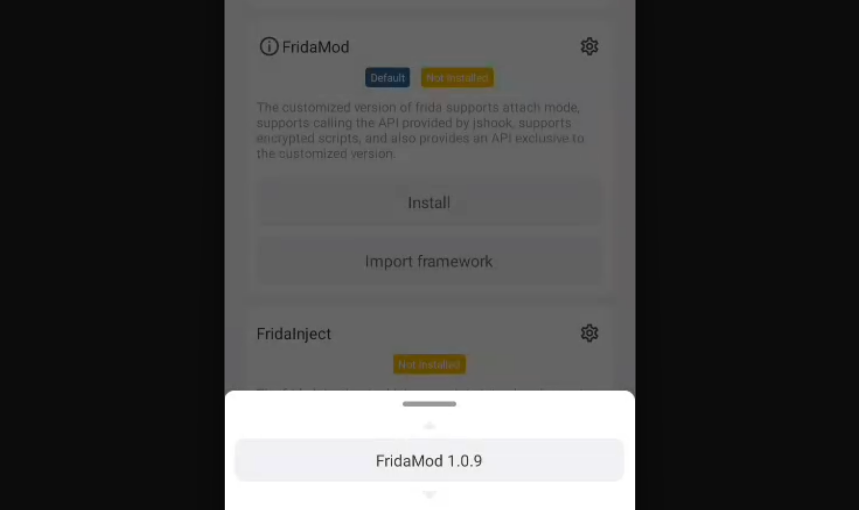
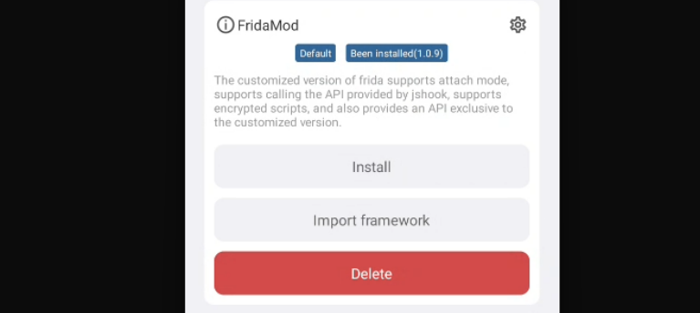
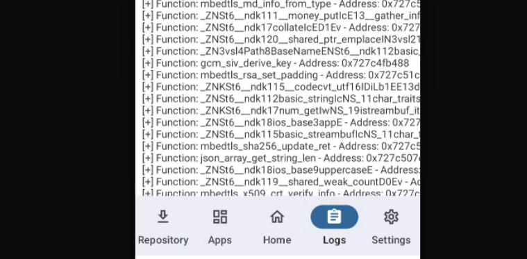

# I. Mở đầu

Bên cạnh sử dụng công cụ frida thực hiện hook, học thêm một số kiểu hook khác nâng cao hơn, dùng trong trường hợp bypass app detect frida chẳng hạn. Cảm ơn người anh `hiepnv` đã giúp đỡ trong quá trình học thêm, quá xịn.

# II. hluda

`hluda` có thể hiểu là frida power hơn, của pháp sư trung hoa, search google cái là thấy một đống blog đến từ các pháp sư.

Cài đặt giống hệt frida thôi, phiên bản `hluda-server` cần tương ứng với frida client, tải về tại: https://github.com/hzzheyang/strongR-frida-android/releases (trong thời điểm hiện tại mới nhất là bản `16.5.6`, mấy bản ở trên repo trống ... cay, nay loay hoay lúc lâu cứ tưởng phải tự build):

Về việc xịn hơn frida ở đâu đợi dịp khác rảnh hơn (đỡ lười hơn) viết tiếp.

# III. jshook + fridamod

Cách này dùng module fridamod trên app Magisk. Cài đặt môi trường trước (tham khảo https://doc.jshook.org/#/md6)

Demo cách dùng `magisk` và `zygisk` cho máy thật. Có `magisk` rồi vào phần settings enable `Zygisk` lên (xong phải restart máy):

Xong cài app `jshook` từ https://jshook.org/, cài xong mở lên sẽ hiện trạng thái chưa actived. Chọn mục `Download Magisk/KernelSU module` cài module zygisk:

Xong quay về app magisk > Modules > Install from storage, cài cái module vừa tải từ jshook về xong sẽ như này:

Vào lại app JsHook sẽ thành activated:

Vào tiếp Framework install `Fridamod`:

Vào tiếp phần Apps > Chọn App muốn hook, chọn:

- Enable Hook service
- Select injection frame: Default (chính là dùng fridamod)
- Enable scripts: Thêm script hook trong này

Cuối cùng mở app trực tiếp lên, là script hook cũng được chạy trong JsHook, xem ở phần Logs:

Tham khảo thêm blog: https://gitcode.csdn.net/65ed83231a836825ed79c2d1.html

# IV. 