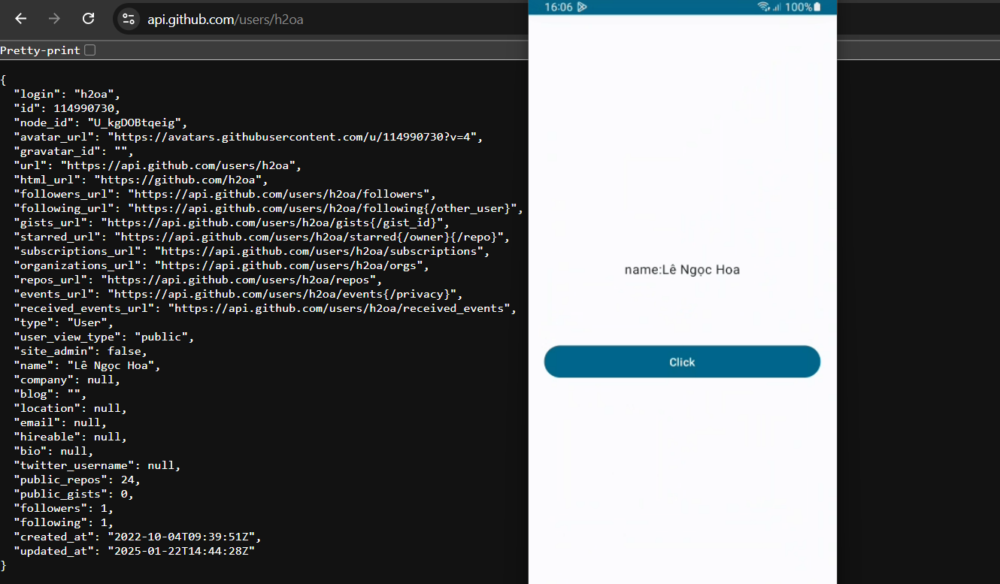
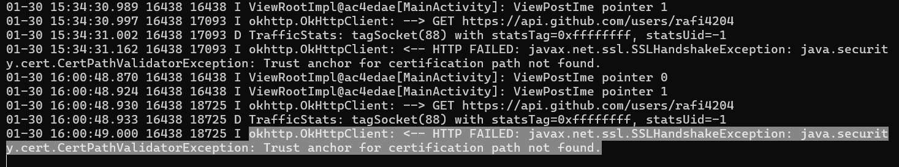
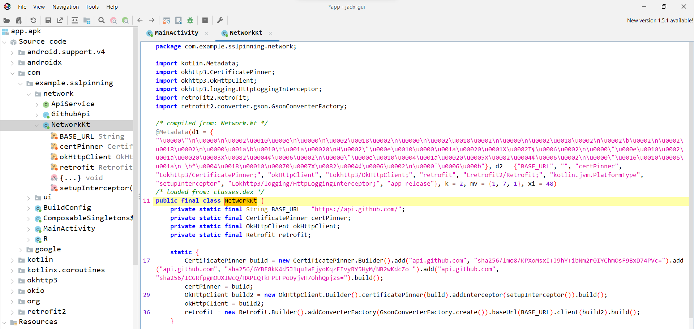
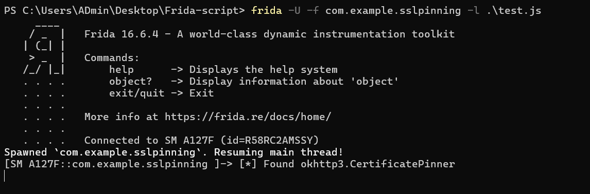
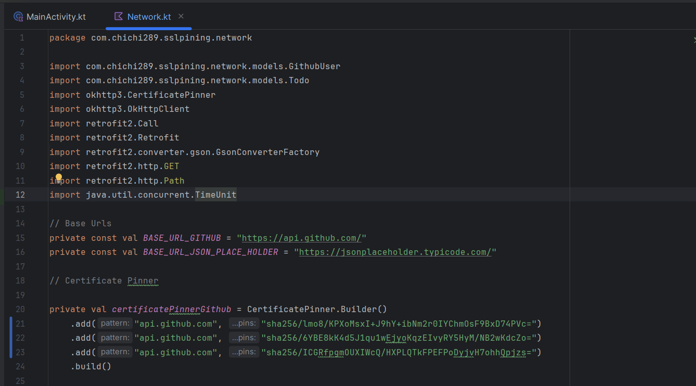
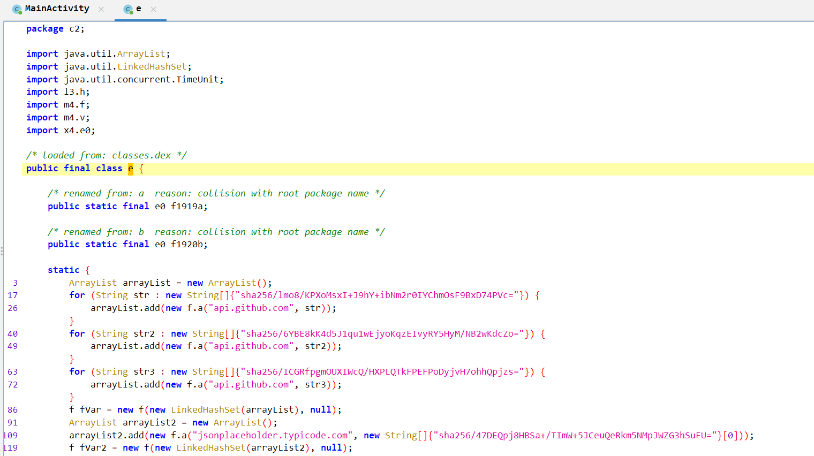
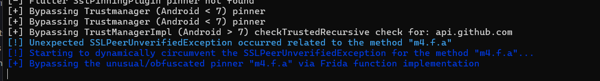
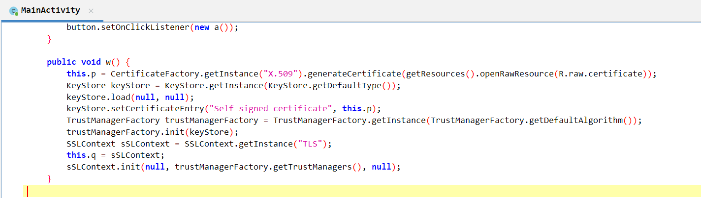

# I. Mở đầu

Lâu rồi gặp ssl pinning chỉ có biết ném 2 script đầu tiên trên https://codeshare.frida.re/, nếu không bypass được thì cũng chịu ... nay quyết định học kỹ lại về món bypass này, vì có nhiều app thực sự không bypass được bằng script free mà phải tự build.

# II. SSL pinning là gì?

Vừa sẵn có văn mẫu lý thuyết hồi chuẩn bị cho phỏng vấn, copy vào đây luôn. Bắt đầu từ SSL/TLS trước:

SSL/TLS được dùng khi sợ trong quá trình client gửi gói tin đến server bị hacker chặn giữa đường (vừa đóng vai trò làm client và vai trò server), nghe lén gói tin và giả mạo dữ liệu trả về.

Hiểu đơn giản SSL/TLS là có một bên thứ ba cung cấp cert uy tín, cài sẵn một đống cert uy tín trong kho system của client. Và bên thứ ba này cũng cung cấp một cái bằng chứng nhận cho một website https. Khi client connect đến trang web https này, trang web show cái bằng ra, client mang cái bằng này vào kho cert check xem đúng không, đúng thì cứ thế connect và gửi/nhận gói tin sau đó. Đây là cách client xác nhận có gửi gói tin đúng nơi nhận hay không, và cũng gọi là quá trình bắt tay.

Hacker bypass quá trình bắt tay này để nghe lén như thế nào?

Đầu tiên hacker install cert vào system trust trong máy victim. Trong bước bắt tay: Client gửi gói tin hello, hacker chặn và gửi cho server, server trả về cert cho hacker, hacker thay bằng bằng chứng nhận của mình và trả về cho client, client check bằng này trong system trust và thấy chuẩn (vì hacker trà trộn một cái giả vào đó trước rồi) --> nghĩ là server chuẩn --> tin. Rồi hai bên trao đổi cách mã hóa dữ liệu và thống nhất ra một session key vừa có thể mã hóa và giải mã, nhưng cũng bị hacker nghe lén. Client tưởng chỉ có client và server biết cái session key này, nhưng hacker cũng biết --> bắt tay kết thúc. Rồi cứ thế gửi nhận gói tin và bị nghe lén.

Các tool proxy chính là một "hacker" như vậy, điển hình như Burpsuite, đấy cũng là lý do vì sao mình phải cài cert vào kho system trust của firefox để đánh lừa nó là thế (nếu dùng browser chrome của nó thì có sẵn cert rồi).

SSL pinning sinh ra để giải quyết vấn đề bị nghe lén như vậy (tránh victim bị attacker cài cert vào điện thoại). SSL chỉ đơn giản so sánh bề mặt của cái bằng chứng nhận. SSL pinning sẽ check cả cái tem dán trên bằng có chuẩn không - hiểu đơn giản là hacker không thể làm giả cái tem này được. Còn cụ thể đi sâu về cái tem này thì thôi đợi dịp khác ...

# III. SSL Pinning và bypass

Ngồi vài hôm tìm đọc tài liệu về một số cách thực hiện SSL Pinning, tổng hợp được chút kiến thức. Note một số blog đọc được:

- https://www.infinisign.com/faq/android-ssl-pinning

## 1. OkHttp

Cách đầu tiên học được là dùng OkHttp thực hiện SSL Pinning. Một app đơn giản bằng Kotlin demo sử dụng OkHttp thực hiện SSL Pinning tại: 

OkHttp thêm chuỗi cặp giá trị website và SSL cert hash vào mã nguồn app. Ví dụ:

```
private val certPinner = CertificatePinner.Builder()
    .add("api.github.com", "sha256/lmo8/KPXoMsxI+J9hY+ibNm2r0IYChmOsF9BxD74PVc=")
    .add("api.github.com", "sha256/6YBE8kK4d5J1qu1wEjyoKqzEIvyRY5HyM/NB2wKdcZo=")
    .add("api.github.com", "sha256/ICGRfpgmOUXIWcQ/HXPLQTkFPEFPoDyjvH7ohhQpjzs=")
    .build()

private val okHttpClient = OkHttpClient.Builder()
    .certificatePinner(certPinner)
    .addInterceptor(setupInterceptor())
    .build()
```

Sử dụng bình thường không có proxy, sau khi chọn Click, fetch data tại `https://api.github.com/users/h2oa` trả về tên `Lê Ngọc Hoa`



Setup Burpsuit proxy xong check log adb thấy lỗi như sau:



Từ jadx cũng xem được OkHttp dependency và đoạn code thêm các hash:



SSL Pinning này bypass bằng https://codeshare.frida.re/@akabe1/frida-multiple-unpinning/ được luôn. Nhưng cần xem chính xác bypass như nào.

Trước hết sẽ kiểm tra app có import `okhttp3.CertificatePinner` hay không:

```
try {
    var CertificatePinner = Java.use('okhttp3.CertificatePinner');
    console.log("[*] Found okhttp3.CertificatePinner");
} catch (err) {
    console.log("[!] Not found okhttp3.CertificatePinner");
    console.log(err);
}
```



Nhắm vào class `CertificatePinner`, `okhttp3.CertificatePinner` sử dụng các hàm `check`, `check$okhttp` kiểm tra SSL pinning, cần hook vào các hàm này và loại bỏ code trong đó.

```
try {
    // Bypass OkHTTPv3 {1}
    var okhttp3_Activity_1 = Java.use('okhttp3.CertificatePinner');
    okhttp3_Activity_1.check.overload('java.lang.String', 'java.util.List').implementation = function(a, b) {
        console.log('[+] Bypassing OkHTTPv3 {1}: ' + a);
        return;
    };
} catch (err) {
    console.log('[-] OkHTTPv3 {1} pinner not found');
    console.log(err);
}
try {
    // Bypass OkHTTPv3 {2}
    // This method of CertificatePinner.check is deprecated but could be found in some old Android apps
    var okhttp3_Activity_2 = Java.use('okhttp3.CertificatePinner');
    okhttp3_Activity_2.check.overload('java.lang.String', 'java.security.cert.Certificate').implementation = function(a, b) {
        console.log('[+] Bypassing OkHTTPv3 {2}: ' + a);
        return;
    };
} catch (err) {
    console.log('[-] OkHTTPv3 {2} pinner not found');
    console.log(err);
}
try {
    // Bypass OkHTTPv3 {3}
    var okhttp3_Activity_3 = Java.use('okhttp3.CertificatePinner');
    okhttp3_Activity_3.check.overload('java.lang.String', '[Ljava.security.cert.Certificate;').implementation = function(a, b) {
        console.log('[+] Bypassing OkHTTPv3 {3}: ' + a);
        return;
    };
} catch(err) {
    console.log('[-] OkHTTPv3 {3} pinner not found');
    console.log(err);
}
try {
    // Bypass OkHTTPv3 {4}
    var okhttp3_Activity_4 = Java.use('okhttp3.CertificatePinner'); 
    okhttp3_Activity_4.check$okhttp.overload('java.lang.String', 'kotlin.jvm.functions.Function0').implementation = function(a, b) {		
        console.log('[+] Bypassing OkHTTPv3 {4}: ' + a);
        return;
    };
} catch(err) {
    console.log('[-] OkHTTPv3 {4} pinner not found');
    console.log(err);
}
```

Trước đó, cần tự custom một cert hoặc import từ cert của Burp để init vào `javax.net.ssl.SSLContext`.

Tự custom một cert, chọn`TrustManager` từ lib `javax.net.ssl.X509TrustManager`, tham khảo: https://codeshare.frida.re/@akabe1/frida-multiple-unpinning/

```
// TrustManager (Android < 7)
var X509TrustManager = Java.use('javax.net.ssl.X509TrustManager');
var SSLContext = Java.use('javax.net.ssl.SSLContext');
var TrustManager = Java.registerClass({
    // Implement a custom TrustManager
    name: 'dev.asd.test.TrustManager',
    implements: [X509TrustManager],
    methods: {
        checkClientTrusted: function(chain, authType) {},
        checkServerTrusted: function(chain, authType) {},
        getAcceptedIssuers: function() {return []; }
    }
});
// Prepare the TrustManager array to pass to SSLContext.init()
var TrustManagers = [TrustManager.$new()];
// Get a handle on the init() on the SSLContext class
var SSLContext_init = SSLContext.init.overload(
    '[Ljavax.net.ssl.KeyManager;', '[Ljavax.net.ssl.TrustManager;', 'java.security.SecureRandom');
try {
    // Override the init method, specifying the custom TrustManager
    SSLContext_init.implementation = function(keyManager, trustManager, secureRandom) {
        console.log('[+] Bypassing Trustmanager (Android < 7) pinner');
        SSLContext_init.call(this, keyManager, TrustManagers, secureRandom);
    };
} catch (err) {
    console.log('[-] TrustManager (Android < 7) pinner not found');
}
```

Import từ cert của Burp, tham khảo: https://codeshare.frida.re/@kooroshh/ssl-pinning-bypass-okhttp4/

```
var CertificateFactory = Java.use("java.security.cert.CertificateFactory");
var FileInputStream = Java.use("java.io.FileInputStream");
var BufferedInputStream = Java.use("java.io.BufferedInputStream");
var X509Certificate = Java.use("java.security.cert.X509Certificate");
var KeyStore = Java.use("java.security.KeyStore");
var TrustManagerFactory = Java.use("javax.net.ssl.TrustManagerFactory");
var SSLContext = Java.use("javax.net.ssl.SSLContext");

// Load CAs from an InputStream
console.log("[+] Loading our CA...")
var cf = CertificateFactory.getInstance("X.509");

try {
    var fileInputStream = FileInputStream.$new("/data/local/tmp/cert-der.crt");
} catch (err) {
    console.log("[o] " + err);
}

var bufferedInputStream = BufferedInputStream.$new(fileInputStream);
var ca = cf.generateCertificate(bufferedInputStream);
bufferedInputStream.close();

var certInfo = Java.cast(ca, X509Certificate);
console.log("[o] Our CA Info: " + certInfo.getSubjectDN());

// Create a KeyStore containing our trusted CAs
console.log("[+] Creating a KeyStore for our CA...");
var keyStoreType = KeyStore.getDefaultType();
var keyStore = KeyStore.getInstance(keyStoreType);
keyStore.load(null, null);
keyStore.setCertificateEntry("ca", ca);

// Create a TrustManager that trusts the CAs in our KeyStore
console.log("[+] Creating a TrustManager that trusts the CA in our KeyStore...");
var tmfAlgorithm = TrustManagerFactory.getDefaultAlgorithm();
var tmf = TrustManagerFactory.getInstance(tmfAlgorithm);
tmf.init(keyStore);
console.log("[+] Our TrustManager is ready...");

console.log("[+] Hijacking SSLContext methods now...")
console.log("[-] Waiting for the app to invoke SSLContext.init()...")

SSLContext.init.overload("[Ljavax.net.ssl.KeyManager;", "[Ljavax.net.ssl.TrustManager;", "java.security.SecureRandom").implementation = function(a, b, c) {
    console.log("[o] App invoked javax.net.ssl.SSLContext.init...");
    SSLContext.init.overload("[Ljavax.net.ssl.KeyManager;", "[Ljavax.net.ssl.TrustManager;", "java.security.SecureRandom").call(this, a, tmf.getTrustManagers(), c);
    console.log("[+] SSLContext initialized with our custom TrustManager!");
}
```

## 2. Học qua lab

Chia ra từng dạng cảm thấy hơi mất thời gian, thôi học qua lab tạm: https://github.com/h2oa/android-ssl-pinning-demo


## Đặt tiêu đề sau

Lúc test thử script frida bypass SSL ở lab demo https://github.com/h2oa/SSLPinning-Android, gặp tình trạng sau khi decompiler thì các lib import bị đổi tên, nhận ra frida script https://codeshare.frida.re/@akabe1/frida-multiple-unpinning/ còn có thể tự đổi tên lib theo, vi diệu, cần dành thời gian học hiểu cơ chế này.

Source gốc:



Source sau khi decompiler bằng jadx, một số lib biến mất, chẳng hạn `okhttp3.CertificatePinner`, thậm chí package `network` cũng bị đổi tên thành `c2`:



Frida log:



# IV. Case study

## 1. Pinned HackTheBox

Mấy hôm trước có bài `Pinned` Hackthebox (https://h2oa.github.io/posts/ctf/htb-mobile/#pinned) phân tích để học được.

Bài này cần bắt request được chức năng login này:


Khi dùng chức năng trong Burpsuite sẽ báo lỗi `The client failed to negotiate a TLS connection to ...`, đây là dấu hiệu của SSL pinning chặn gói tin:


Check `adb logcat` và gửi request:


Báo lỗi: `System.err: javax.net.ssl.SSLHandshakeException: java.security.cert.CertPathValidatorException: Trust anchor for certification path not found`, cho thấy chính xác là SSL handshake thất bại. Có thể thấy đoạn code check cert trong apk file:


Hàm `w()` được gọi khi chúng ta click button đăng nhập, đây là hàm tự tạo một cert custom:



Cuối cùng cert custom này được khởi tạo qua hàm `init()` của lib `javax.net.ssl.SSLContext`:

```
SSLContext sSLContext = SSLContext.getInstance("TLS");
sSLContext.init(null, trustManagerFactory.getTrustManagers(), null);
```

Nên có thể tự import cert của Burpsuite và hook vào hàm `javax.net.ssl.SSLContext.init()` để thêm cert của Burpsuite vào hoặc tự custom cert cũng được (xem lại phần OkHttp).

## 2. 

# Note

https://blog.csdn.net/Ananas_Orangey/article/details/126219966