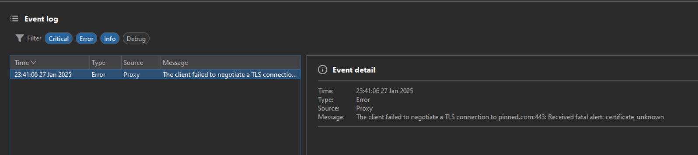

# I. Mở đầu

Lâu rồi gặp ssl pinning chỉ có biết ném 2 script đầu tiên trên https://codeshare.frida.re/, nếu không bypass được thì cũng chịu ... nay quyết định học kỹ lại về món bypass này, vì có nhiều app thực sự không bypass được bằng script free mà phải tự build.

# II. SSL pinning là gì?

Vừa sẵn có văn mẫu lý thuyết hồi chuẩn bị cho phỏng vấn, copy vào đây luôn. Bắt đầu từ SSL/TLS trước:

SSL/TLS được dùng khi sợ trong quá trình client gửi gói tin đến server bị hacker chặn giữa đường (vừa đóng vai trò làm client và vai trò server), nghe lén gói tin và giả mạo dữ liệu trả về.

Hiểu đơn giản SSL/TLS là có một bên thứ ba cung cấp cert uy tín, cài sẵn một đống cert uy tín trong kho system của client. Và bên thứ ba này cũng cung cấp một cái bằng chứng nhận cho một website https. Khi client connect đến trang web https này, trang web show cái bằng ra, client mang cái bằng này vào kho cert check xem đúng không, đúng thì cứ thế connect và gửi/nhận gói tin sau đó. Đây là cách client xác nhận có gửi gói tin đúng nơi nhận hay không, và cũng gọi là quá trình bắt tay.

Hacker bypass quá trình bắt tay này để nghe lén như thế nào?

Đầu tiên hacker install cert vào system trust trong máy victim. Trong bước bắt tay: Client gửi gói tin hello, hacker chặn và gửi cho server, server trả về cert cho hacker, hacker thay bằng bằng chứng nhận của mình và trả về cho client, client check bằng này trong system trust và thấy chuẩn (vì hacker trà trộn một cái giả vào đó trước rồi) --> nghĩ là server chuẩn --> tin. Rồi hai bên trao đổi cách mã hóa dữ liệu và thống nhất ra một session key vừa có thể mã hóa và giải mã, nhưng cũng bị hacker nghe lén. Client tưởng chỉ có client và server biết cái session key này, nhưng hacker cũng biết --> bắt tay kết thúc. Rồi cứ thế gửi nhận gói tin và bị nghe lén.

Các tool proxy chính là một "hacker" như vậy, điển hình như Burpsuite, đấy cũng là lý do vì sao mình phải cài cert vào kho system trust của firefox để đánh lừa nó là thế (nếu dùng browser chrome của nó thì có sẵn cert rồi).

SSL pinning sinh ra để giải quyết vấn đề bị nghe lén như vậy (tránh victim bị attacker cài cert vào điện thoại). SSL chỉ đơn giản so sánh bề mặt của cái bằng chứng nhận. SSL pinning sẽ check cả cái tem dán trên bằng có chuẩn không - hiểu đơn giản là hacker không thể làm giả cái tem này được. Còn cụ thể đi sâu về cái tem này thì thôi đợi dịp khác ...

# III. Bypass SSL pinning

Giờ viết luôn lý thuyết cũng chịu, cứ vào thẳng một bài CTF đã, mấy hôm trước có bài `Pinned` Hackthebox (https://h2oa.github.io/posts/ctf/htb-mobile/#pinned) phân tích để học được.

Bài này cần bắt request được chức năng login này:

Khi dùng chức năng trong Burpsuite sẽ báo lỗi `The client failed to negotiate a TLS connection to ...`, đây là dấu hiệu của SSL pinning chặn gói tin:

Check `adb logcat` và gửi request:

Báo lỗi: `System.err: javax.net.ssl.SSLHandshakeException: java.security.cert.CertPathValidatorException: Trust anchor for certification path not found`, cho thấy chính xác là SSL handshake thất bại. Có thể thấy đoạn code check cert trong apk file:

... Tự nhiên nhận ra phải biết code SSL pinning đã, thôi chuyển sang học code mobile nhỉ ... Tạm dừng bài viết, học xong code mobile quay lại @@